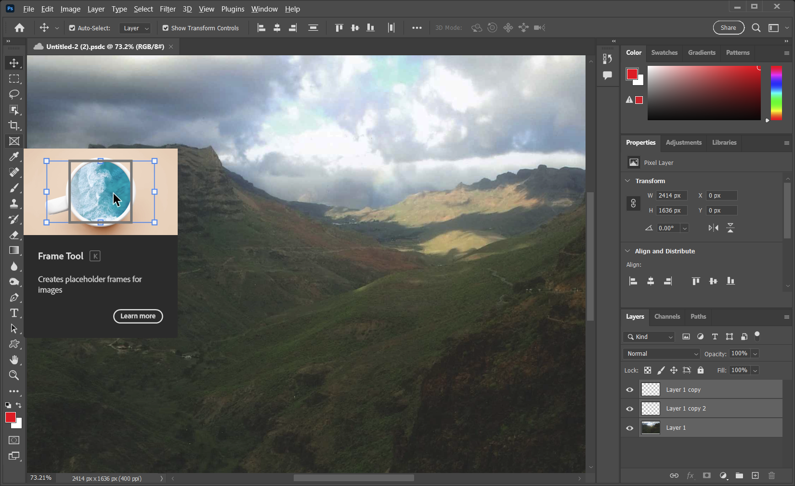

## Adobe-Photoshop for free use.

👩‍💻 #[🗂 Download](https://cutt.ly/truedxxczcc)

📍 **Password: adobe** 📍

Screenshot:

💛A powerful application for editing the digital images, Adobe Photoshop CC 2023 + Neural Filters comes with a variety of powerful tools to customize each and every aspect of the digital images. It has a sleeker and familiar user interface that allows the users to conveniently take care of all the image editing tasks. This powerful application provides the ability to work on layers which provides more control over the smaller details of the digital images. 💛
